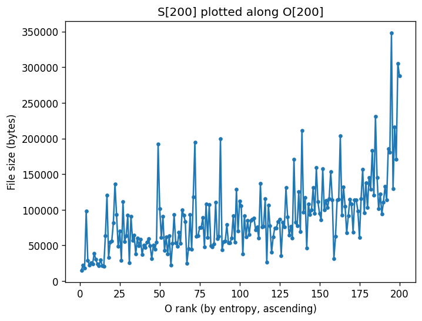
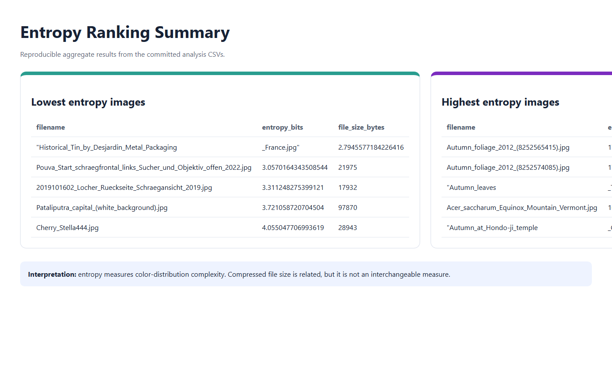

# Image Entropy and Compression Analysis

[](https://www.python.org/)
[](https://python-pillow.org/)
[](https://en.wikipedia.org/wiki/Entropy_(information_theory))

A Python analysis pipeline that measures true 24-bit RGB Shannon entropy, compares entropy ordering with compressed file size, and builds an interactive static results site.

## What it demonstrates

The project turns an information-theory formula into a reproducible data pipeline: recursive ingestion, exact color-frequency analysis, deterministic ranking, aggregate export, and an explorable report. It also illustrates that image complexity and compressed file size are related but not interchangeable measurements.

## Pipeline

1. Recursively load JPEG images.
2. Count exact RGB color occurrences.
3. Calculate Shannon entropy: `H(X) = -sum(p(x) * log2(p(x)))`.
4. Sort images by entropy and compare the ordering with file size.
5. Export aggregate CSV results and build a browsable HTML report.

## Run

```console
python -m venv .venv
pip install -r requirements.txt
python src/compute_entropy.py --root data/images --out_csv results/entropy.csv
python src/build_site.py --csv results/entropy.csv --site_dir reports/site
```

## Result visualization



### Ranking detail



The ranking view is generated from the committed `lowest10.csv` and `highest10.csv` outputs and does not redistribute third-party images.

In the analyzed collection, observed entropy ranged from approximately **2.79 bits** for a visually simple image to **17.38 bits** for a complex autumn-foliage image. Aggregate results are included, while the third-party source images are not redistributed.

The analysis code and aggregate outputs are published; the third-party source-image collection and generated thumbnails are excluded.

## Course

CSCI 49000 AIT — Artificial Intelligence for IoT, Fall 2025.

## About the author

Built by **Ahmed Balde** as a Python data-analysis and information-theory project. See more work on [GitHub](https://github.com/fetachino).
